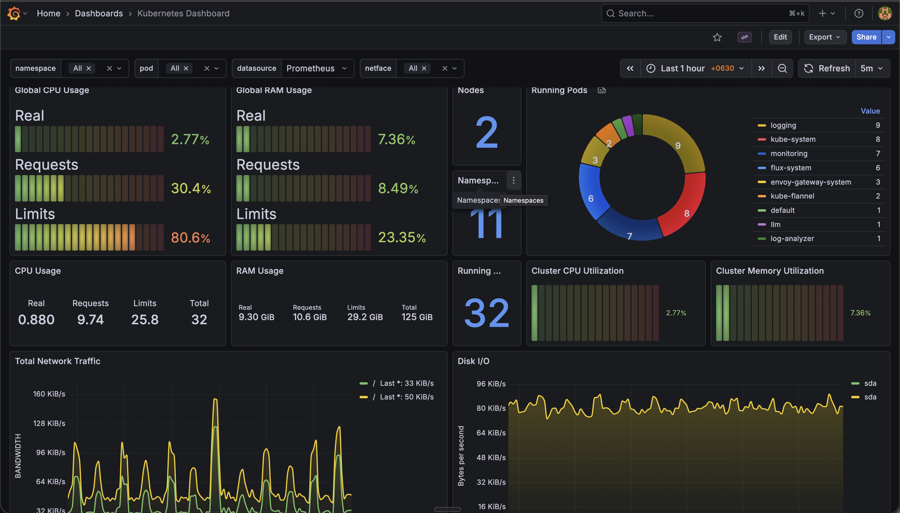
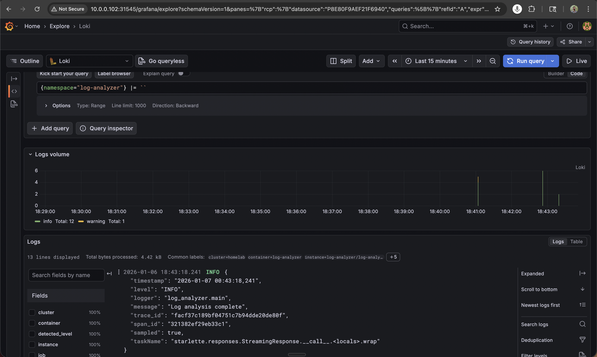
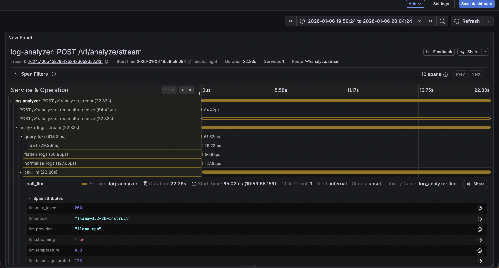

# K8s Homelab LLM Observability & Evaluation Platform

Production-grade LLM observability platform built from scratch on self-hosted Kubernetes.

### Live System

*Prometheus metrics: LLM inference pod CPU/memory and request rate*


*Loki: Real-time log aggregation from all cluster pods*


*Tempo trace: Full request breakdown - prompt rendering (4ms), Loki query (61ms), **CPU-only LLM inference (22.2s)**.
The high inference latency is the tradeoff for $0/month hosting on my own hardware vs cloud GPU costs.*

## Why I Built This
I built this to understand LLM systems from first principles rather than relying on abstractions.
Gen-AI is just another tech stack - what are the core primitives, tradeoffs, and failure modes?

**My approach:** Run models on my own hardware, measure actual latency (not benchmarks),
define my own observability primitives, and iterate on prompts with content-based versioning.

**This enables:**
- Measuring behavior across different models, configs, and prompts
- A/B testing design choices with real metrics
- Understanding latency through distributed tracing
- Pushing limits of CPU inference with SLMs

This is my deliberate practice environment for LLM systems engineering, were I can workout my ideas, make mistakes and crystallize fundamental understandings about LM-based systems.

**Skills demonstrated:** MLOps • Platform Engineering • LLM Observability • API Design •
  Kubernetes • End-to-End Systems Thinking

**Development Journal:** I maintain a [daily TIL (Today I Learned)](./TIL.md)) documenting technical decisions,
  debugging notes, and lessons learned. It provides transparency into my development process and
  design tradeoffs.
---

## ASCII Architecture (produced by Claude)
```
                              ┌─────────────────────────────────┐
                              │       GitHub Repository         │
                              │   k8s-slm-log-agent (main)      │
                              └──────────────┬──────────────────┘
                                             │ Git Sync
                                             ▼
┌────────────────────────────────────────────────────────────────────────────┐
│                              Flux CD GitOps                                │
│  ┌──────────────┐  ┌───────────────┐  ┌──────────────────────────────┐     │
│  │ GitRepository│  │ Kustomizations │  │   Helm Controller           │     │
│  │  Controller  │─▶│ infrastructure │─▶│   (7 HelmReleases)          │     │
│  └──────────────┘  │   workloads    │  └──────────────────────────────┘    │
│                    └───────────────┘                                       │
└────────────────────────────────────────────────────────────────────────────┘
                                             │
                                             │ Deploys & Reconciles
                                             ▼
┌────────────────────────────────────────────────────────────────────────────┐
│                   Kubernetes v1.35.0 (2-Node Cluster)                      │
│                          Flannel CNI (VXLAN)                               │
└────────────────────────────────────────────────────────────────────────────┘
                                             │
        ┌────────────────────────────────────┴─────────────────────────────┐
        │                                                                  │
        ▼                                                                  ▼
┌─────────────────────────────────┐                    ┌─────────────────────────────────┐
│       Node 1 (Control Plane)    │                    │       Node 2 (Worker)           │
│     10.0.0.102 - hardware=light │                    │   10.0.0.103 - hardware=heavy   │
│                                 │                    │       Taint: heavy=true         │
└─────────────────────────────────┘                    └─────────────────────────────────┘

┌──────────────────────────────────────────────────────────────────────────────────┐
│                            Ingress & Routing Layer                               │
│  ┌────────────────────────────────────────────────────────────────────────┐      │
│  │                         Envoy Gateway (Node 1/2)                       │      │
│  │  ┌───────────┐    ┌────────────────┐    ┌──────────────────────┐       │      │
│  │  │  Gateway  │───▶│   HTTPRoutes   │───▶│  Backend Services    │       │      │
│  │  │   (eg)    │    │ - /grafana     │    │ - grafana:80         │       │      │
│  │  │ Port 80   │    │ - /test        │    │ - test-service:8080  │       │      │
│  │  └───────────┘    └────────────────┘    └──────────────────────┘       │      │
│  └────────────────────────────────────────────────────────────────────────┘      │
└──────────────────────────────────────────────────────────────────────────────────┘
                                        │
                     ┌──────────────────┼──────────────────┐
                     │                  │                  │
                     ▼                  ▼                  ▼
┌────────────────────────────────────────────────────────────────────────────────┐
│                          Observability Stack (logging ns)                      │
│                                                                                │
│  ┌──────────────┐      ┌──────────────┐      ┌──────────────┐                  │
│  │   Grafana    │◀────▶│     Loki     │◀────▶│    Tempo     │                  │
│  │  (Node 1)    │      │  (Node 2)    │      │  (Node 2)    │                  │
│  │ Dashboards & │      │ Log Storage  │      │   Traces     │                  │
│  │     UI       │      │   3100/tcp   │      │              │                  │
│  └──────────────┘      └──────────────┘      └──────────────┘                  │
│         ▲                      ▲                     ▲                         │
│         │                      │                     │                         │
│         │              ┌───────┴──────┐              │                         │
│         │              │              │              │                         │
│  ┌──────┴──────┐  ┌───┴────┐   ┌────┴────┐   ┌─────┴──────┐                    │
│  │   Alloy     │  │ Alloy  │   │ Alloy   │   │   Alloy    │                    │
│  │  (Node 1)   │  │(Node 2)│   │(Node 1) │   │  (Node 2)  │                    │
│  │ Log Collect │  │Logs    │   │ Traces  │   │  Traces    │                    │
│  └─────────────┘  └────────┘   └─────────┘   └────────────┘                    │
│        ▲              ▲              ▲              ▲                          │
│        └──────────────┴──────────────┴──────────────┘                          │
│                   Scrapes all pod logs & traces                                │
└────────────────────────────────────────────────────────────────────────────────┘

┌────────────────────────────────────────────────────────────────────────────────┐
│                    Monitoring Stack (monitoring ns)                            │
│                                                                                │
│  ┌──────────────────┐      ┌─────────────────┐      ┌──────────────────┐       │
│  │   Prometheus     │◀────▶│  Kube State     │      │  Metrics Server  │       │
│  │    (Node 2)      │      │    Metrics      │      │    (Node 1)      │       │
│  │ Metrics Storage  │      │   (Node 2)      │      │  Resource API    │       │
│  │    :80/tcp       │      │  K8s Objects    │      │                  │       │
│  └────────┬─────────┘      └─────────────────┘      └──────────────────┘       │
│           │                                                                    │
│           │ Scrapes                                                            │
│           │                                                                    │
│  ┌────────┴────────────────────────────────────────────┐                       │
│  │                                                      │                      │
│  ▼                          ▼                           ▼                      │
│  ┌──────────────┐    ┌──────────────┐         ┌──────────────┐                 │
│  │ Node Exporter│    │Node Exporter │         │  Pushgateway │                 │
│  │  (Node 1)    │    │  (Node 2)    │         │   (Node 2)   │                 │
│  │ Host Metrics │    │ Host Metrics │         │ Batch Metrics│                 │
│  └──────────────┘    └──────────────┘         └──────────────┘                 │
└────────────────────────────────────────────────────────────────────────────────┘

┌────────────────────────────────────────────────────────────────────────────────┐
│                          AI/ML Intelligence Stack                              │
│                                                                                │
│  ┌───────────────────────────────────────────────────────────────────────┐     │
│  │                       Log Analyzer Service (Node 1)                   │     │
│  │                         log-analyzer namespace                        │     │
│  │  ┌──────────────────────────────────────────────────────────────┐     │     │
│  │  │              FastAPI Application (:8000)                     │     │     │
│  │  │                                                              │     │     │
│  │  │  1. Collects logs from Loki (LogQL queries)                  │     │     │
│  │  │  2. Builds prompts via Prompt Registry                       │     │     │
│  │  │  3. Sends to Llama.cpp for analysis                          │     │     │
│  │  │  4. Returns structured insights                              │     │     │
│  │  └──────────────────────────────────────────────────────────────┘     │     │
│  └────────────────┬───────────────────────────┬───────────────────────────┘    │
│                   │                           │                                │
│                   │ Queries                   │ Inference                      │
│                   ▼                           ▼                                │
│       ┌──────────────────┐        ┌──────────────────────┐                     │
│       │       Loki       │        │     Llama.cpp        │                     │
│       │    (Node 2)      │        │     (Node 2)         │                     │
│       │  logging:3100    │        │   llm namespace      │                     │
│       └──────────────────┘        │                      │                     │
│                                   │  Llama 3.2 3B Model  │                     │
│                                   │    (GGUF Q4_K_M)     │                     │
│                                   │   OpenAI-compatible  │                     │
│                                   │      API :8080       │                     │
│                                   └──────────────────────┘                     │
└────────────────────────────────────────────────────────────────────────────────┘

┌─────────────────────────────────────────────────────────────────────────────────┐
│                           Storage Architecture                                  │
│                                                                                 │
│                            Node 2: /mnt/k8s-storage                             │
│                          (Samsung NVMe 477GB SSD)                               │
│                                                                                 │
│  ┌────────────────┐    ┌────────────────┐    ┌────────────────────┐             │
│  │   loki-pv      │    │   tempo-pv     │    │ llama-models-pv    │             │
│  │   200GB        │    │    50GB        │    │      20GB          │             │
│  │ Local Storage  │    │ Local Storage  │    │  Local Storage     │             │
│  └────────────────┘    └────────────────┘    └────────────────────┘             │
└─────────────────────────────────────────────────────────────────────────────────┘

┌────────────────────────────────────────────────────────────────────────────────┐
│                         Key Architectural Patterns                             │
│                                                                                │
│  • GitOps: Flux CD reconciles from main branch (infrastructure + workloads)    │
│  • Workload Placement: Node labels (hardware=light/heavy) + taints             │
│  • Observability: Unified Alloy collectors → Loki (logs) + Tempo (traces)      │
│  • Metrics: Prometheus scrapes node-exporter, kube-state-metrics, services     │
│  • AI Pipeline: FastAPI → Loki → Prompt Registry → Llama.cpp                   │
│  • Ingress: Envoy Gateway with Gateway API (HTTPRoute resources)               │
│  • Storage: Static PVs on Node 2 NVMe for stateful workloads                   │
└────────────────────────────────────────────────────────────────────────────────┘
```

---

## Core Tools
- [K8s](https://kubernetes.io/docs/home/)
- [Flux](https://fluxcd.io/flux/concepts/)
- [llama.cpp](https://github.com/ggml-org/llama.cpp)
- [OTel](https://opentelemetry.io/docs/specs/otel/)
- [Loki](https://github.com/grafana/loki)
- [Prometheus](https://prometheus.io/docs/introduction/overview/)
- [Grafana](https://grafana.com/docs/grafana/latest/)
- [Alloy](https://grafana.com/docs/alloy/latest/)
- [Tempo](https://grafana.com/docs/tempo/latest/)
- [FastAPI](https://fastapi.tiangolo.com/advanced/)
- [Just](https://just.systems/man/en/)
- [uv](https://docs.astral.sh/uv/getting-started/installation/)
- [ty](https://docs.astral.sh/ty/)
- [Ruff](https://docs.astral.sh/ruff/)
- [Docker](https://docs.docker.com/)
- [Claude](https://code.claude.com/docs/en/overview)

### Kubernetes & GitOps

- 2-node Kubernetes homelab
- **Flux** for GitOps reconciliation
- Explicit placement strategy:
  - Node 1: control plane + UX
  - Node 2: LLM inference, Loki, evaluation jobs


### LLM Serving

- `llama.cpp` behind an HTTP API
- Model selection driven by **latency vs accuracy**, not vibes
- Quantization is a first-class tuning parameter

### Observability (OTel-First)

Everything flows through **OpenTelemetry**:
- Traces → Tempo
- Logs → Loki
- Metrics → Prometheus
- One UI: Grafana

---

## Evaluation Framework (In Progress)

✅ **Completed:** Golden dataset of 500+ labeled log examples from real cluster failures
⏳ **Current Work:** Designing eval metrics (precision/recall on root cause detection)
📅 **Next:** Automated eval pipeline with Prometheus metrics export

**Goal:** Rigorous A/B testing of prompts with measurable outcomes, not vibes.